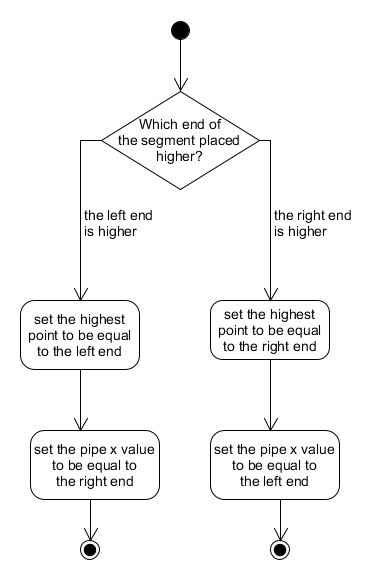

<div align="right">
    <p>04/18/2019</p> 
<p>Armandas Rokas (s185144) 
</p>
</div>
</br>
</br>
</br>
</br>

<center><h1>
    C assignment 3
    </h1> 
    <p> PROBLEM 1: Piping system for roofs</p>


</br>
</br>
</br>
</br>

</br>

**Table of contents**

- [Intro](#intro)
- [Main](#main)
- [Initializing segments](#initializing-segments)
- [Sorting segments](#sorting-segments)
- [Unsorting segments](#unsorting-segments)
- [Calculating how much water is down from each segment](#calculating-how-much-water-is-down-from-each-segment)
- [Testing](#testing)
- [Conclusion](#conclusion)


 <div style="page-break-after: always;"></div>


## Intro

This document describes the implementation of "Piping system for roofs" solution. 

## Main

The main function starts by asking for the number of segments to be inserted. Then initializing an array of segments, which length equals to the inserted number by using `malloc` function.  

Next, there are called `init_segments`,  `sort_Segments`, `calculateSegmentsPipes` `unsortSegements  ` functions respectively with corresponding arguments.  

Finally, the main function prints how much water is down from each segment of the roof using `printf` function.  

The flow chart in *Figure 1* tries to illustrate that.


*Figure 1*

```C
int main(){
	int numInputs;
	scanf("%d", &numInputs);
	segment * segments = (segment *) malloc(numInputs* sizeof(segment));
	init_segments(segments, numInputs);
	sortSegments(segments, numInputs);
	calculateSegmentsPipes(segments, numInputs);
	unsortSegments(segments, numInputs);
    printSegmentsPipeFlow(segments, numInputs);

	return 0;
}
```

## Initializing segments

The function `init_segments` loops n times, where n equals to the number of segments.  Each time should be inserted four values representing coordinates of the right end of segment and the left end of segment. Then everything is set to corresponding segment `struct` and that segment is inserted to the array of segments.  

In addition, the function calculates the `highest point` and the `pipe x value` too. The `highest point` means that it finds which of these two `y`  values, i.e the left end of segment or the right end of segment , is higher. The highest point will be used later for sorting segments. The `pipe x value` is set to be at that end, where `y` is lower. The flow diagram in *Figure 2* tries to illustrate that.  



*Figure 2*

  ```C
void init_segments(segment * segments, int n){
	for(int i = 0; i < n; i++) {
		int startx;
		int starty;
		int endx;
		int endy;
		scanf("%d %d %d %d", &startx, &starty, &endx, &endy);
		segment * temp = (segment *) malloc(sizeof(segment));
		temp->start.x = startx;
		temp->start.y = starty;
		temp->end.x = endx;
		temp->end.y = endy;
		if(starty > endy){
			temp->highestPoint = starty;
			temp->pipe_X_value = endx;
		} else{
			temp->highestPoint = endy;
			temp->pipe_X_value = startx-1;
		}
		temp->index = i;
		temp->isSetOnArray = 0;
		segments[i] = *temp;
	}
}
  ```


## Sorting segments

The sorting of segments is very important for the following program, because the segments has to be inserted to the algorithm from the highest segment to the lowest segments. Because most often the lower segments depends on the higher segments, e.g. it can hide from water or collect even more water, if the end of the above placed segment is somewhere in between of the below placed segment.  

The sorting is implemented using the insertion sort algorithm, which takes one element at the time and moves to the left unit there is found the segments with higher point then the current.  So at the termination the segment with highest point is the first element.

```C
void sortSegments(segment * segments, int inputs) {
	int j, i;
	for(j = 1; j < inputs; j++){
		segment key = segments[j];
		i = j-1;
		while(i>=0 && segments[i].highestPoint < key.highestPoint){
			segments[i+1] = segments[i];
			i--;
		}
		segments[i+1] = key;
	}
}
```

## Unsorting segments

There is the need of unsorting the segments at the end of program in order to print segments pipes values in the same sequence as their was inserted. 

The function works just like the sorting  algorithm above, but only it sorts by an index, which was inserted when the segments was initialized.


## Calculating how much water is down from each segment

The basic idea behind the algorithm is that there is creating an array `currWaterFall_Xaxis`which represents x-axis. At the beginning all values is set to be 1's that means 1 liter of water is falling at that `x`. And then there is inserting one segment at the time from the highest to the lowest changing values in the array. 

First there is inserting the calculated total sum of the segment, where is `pipe x value`.  And then there are inserting 0's between the beginning of the segment and the end of the segment.

The algorithm is separated into three functions `calculateSegmentsPipes`, `returnSegmentsPipeLitersInArray`and `setSegmentIntoArray`. 

The `calculateSegmentsPipes` firstly initialize the mentioned array and basically calls the `setSegmentsIntoArray` function for each segment. The tricky part here is that there is another `for loop` here, which is used to find the special case, where the algorithm should behave differently, i.e insert one of the below placed segments before the current above placed segment.  The flow diagram in *Figure 3* tries to illustrate that. 


*Figure 3*

The `special case` occurs when the above placed segment is depend on the below placed segment.  The figure below shows that case. Here B should be put into the array before, because A depends on B by meaning that there should be collected more water on A which is dropped from B. So by inserting A first and B after it will give wrong answer that why B should be inserted first. The case is when: 

```
yA2 < yB1
xA2 > xB1
xA1 < xB1
```


*Figure 4*

The `returnSegmentsPipeLitersInArray` is used to find the total collected water in the segment, which will be used in the `currWaterFall_Xaxis` array. In addition, the function sets the calculated `pipe_liters` value to the current segment, so it can be used to print at the end of program. 

```C
void calculateSegmentsPipes(segment *segments, int numInputs) {
	int * currWaterFall_Xaxis = (int *) malloc(SIZE_OF_X_AXIS* sizeof(int));
	for(int i = 0; i< SIZE_OF_X_AXIS; i++){
		currWaterFall_Xaxis[i] = 1;
	}

	for(int i = 0; i < numInputs; i++){
		for(int j = i+1; j < numInputs; j++) {
			if (segments[i].end.y < segments[j].start.y
				&& segments[i].end.x > segments[j].start.x
				&& segments[i].start.x < segments[j].start.x){
				if (segments[j].isSetOnArray == 0) {
					setSegmentIntoArray(currWaterFall_Xaxis, &segments[j]);
				}
			}
		}
		if(segments[i].isSetOnArray == 0){
			setSegmentIntoArray(currWaterFall_Xaxis, &segments[i]);
		}
	}
}

void setSegmentIntoArray(int * array, segment * s){
	array[s->pipe_X_value] = returnSegmentPipeLitersInArray(array, s);
	for(int i = s->start.x; i < s->end.x; i++){
		*(array + i) = 0;
	}
	s->isSetOnArray = 1;

}
int returnSegmentPipeLitersInArray(int * array, segment *s){
	int totalValue = 0;
	for(int i = s->start.x; i< s->end.x; i++){
		totalValue += array[i];
	}
	s->pipe_liters = totalValue;
	totalValue += array[s->pipe_X_value];
	return totalValue;
}
```

## Testing

For testing purposes there was created test cases and the program was tested according them.  Below there is just some of these test cases. 

Most of the bugs was fixed under the testing, but there are still some cases where the program gives unexpected output like in the test case 4. 

```
########Case 1: Input######
6
13 7 15 6
3 8 7 7
1 7 5 6
5 5 9 3
6 3 8 2
9 6 12 8
##Expected & Actual:##
2
4
2
11
0
3

######## Case 2: Input######
3
8 4 9 20
7 1 12 4
10 6 13 8
##Expected##
1
3
6
##Actual##
1
3
6

######## Case 3: Input######
4
1 9 4 6
3 5 7 6
1 4 4 2
3 1 7 3
##Expected##
3
6
6
6
##Actual##
3
6
6
6

######## Case 4: Input######
2
8 2 10 5
4 5 8 3
##Expected##
6
4
##Actual##
2
6
```


## Conclusion

The main goal to develop piping system was accomplished, because most of test cases is passed. There are still some rare cases where program fails, but the developing was stopped because of time reasons. 

In general, the task was very challenging and time consuming, but it gave an opportunity to use learned knowledge from `C` courses like data types, arrays, pointers, memory allocating, struct and so on. So I satisfied both on the result of the program and the learning process.  

